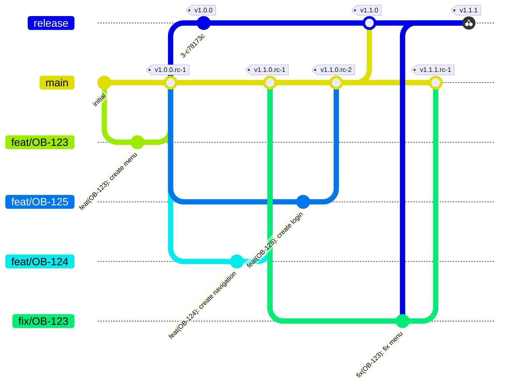

## Semantic Release example repository

This repository is an example of how to use semantic release to automatically generate release notes and create JIRA releases.

### How to use

Make sure you have the env variables and nodejs version set up, to make life easier we are using [asdf](https://asdf-vm.com/) with [asdf-nodejs](https://github.com/asdf-vm/asdf-nodejs) to manage nodejs versions, see .tools-versions

1. Clone the repository
2. Run `asdf install` to install the correct nodejs version
3. Run `npm install` to install the dependencies (also calls prepare, so husky is installed)

### Commit messages

We are using [conventional commits](https://conventionalcommits.org/) to standardize commit messages, this provides a way to generate changelogs and create releases.

Ontop of conversational commits, we are also using [jira-releases](https://github.com/cycjimmy/semantic-release-jira-releases) to create releases in JIRA, this is used to create a new JIRA ticket for the release. But for this plugin to work we need to use the `OB` prefix for the JIRA ticket number as the subject. Example:

```
feat(OB-1234): this is a test commit
```
### Pre commit hooks

We are using [husky](https://github.com/typicode/husky) to manage pre-commit hooks, this is used to run the lint and test commands before committing. You can install the husky hooks by running `npm prepare`.

### Git strategy and releasing

Using trunk based development, we can integrate feature branches to main whenever we want. All merges to main trigger a RC release, and optional deploys to dev environments.
When you need a release you need to merge main into the release branch, this will trigger final release including, release notes and JIRA ticket updates.




